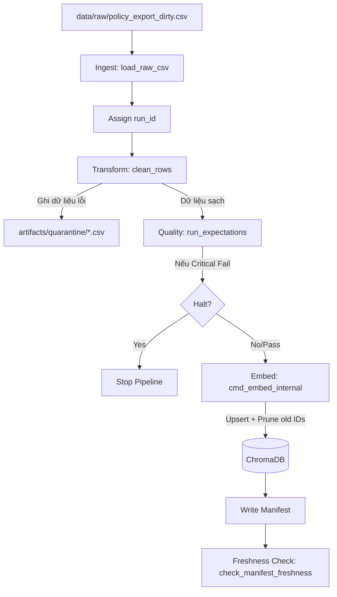

# Kiến trúc pipeline — Lab Day 10

**Nhóm:** X03
**Cập nhật:** 15/04/2025

---

## 1. Sơ đồ luồng (Flow Overview)

---

## 2. Ranh giới trách nhiệm

| Thành phần | Input | Output | Mô tả |
|------------|-------|--------|--------------|
| **Ingest** | `data/raw/policy_export_dirty.csv` | List[dict] (rows) | Đọc dữ liệu từ nguồn, khởi tạo logger và `run_id`. |
| **Transform** | Raw rows | Cleaned rows + Quarantine rows | Xử lý logic làm sạch (refund fix, date format, dedupe). |
| **Quality** | Cleaned rows | Validation Results | Kiểm tra tính toàn vẹn (schema, null, logical rules). |
| **Embed** | Cleaned CSV | ChromaDB Vector Store | Chuyển text thành vector, cập nhật collection (Idempotent). |
| **Monitor** | Manifest file | SLA Status (PASS/FAIL) | Kiểm tra độ tươi (freshness) của dữ liệu vừa cập nhật. |

---

## 3. Idempotency & rerun

- **Chiến lược:** Pipeline sử dụng phương thức `upsert` của ChromaDB dựa trên `chunk_id`. 
- **Chống Duplicate:** Mỗi khi chạy, pipeline thực hiện bước **Pruning** — so sánh danh sách ID mới với ID cũ trong DB. Những ID không còn tồn tại trong bản publish mới sẽ bị xóa (`col.delete`).
- **Kết quả:** Việc chạy lại (rerun) cùng một bộ dữ liệu nhiều lần sẽ không làm tăng số lượng vector, đảm bảo độ chính xác cho retrieval.

---

## 4. Liên hệ Day 09

Pipeline này đóng vai trò là tầng **Data Ingestion** cho Agent của Day 08/09:
- Nó làm mới corpus trong `ChromaDB` mà Agent sử dụng để tìm kiếm (retrieval).
- Đảm bảo Agent không đọc phải các chính sách cũ (stale policy) như "hoàn tiền 14 ngày" nhờ vào các quy tắc cleaning và validation.

---

## 5. Rủi ro đã biết

- **Logic Ordering Risk:** Các quy tắc làm sạch mới nếu đặt không đúng vị trí trong vòng lặp (như việc append vào cleaned trước khi lọc) có thể khiến dữ liệu rác vẫn lọt vào Vector Store. (Đã sửa lỗi này)
- **Expectation Bias:** Các bộ kiểm tra không bao quát hết các kịch bản dữ liệu xấu thực tế dẫn đến "garbage in, garbage out".
- **ChromaDB Lock:** Nếu có nhiều process cùng ghi vào database một lúc có thể gây xung đột.
- **Model Download:** Lần đầu chạy cần internet để tải embedding model, có thể gây timeout.
